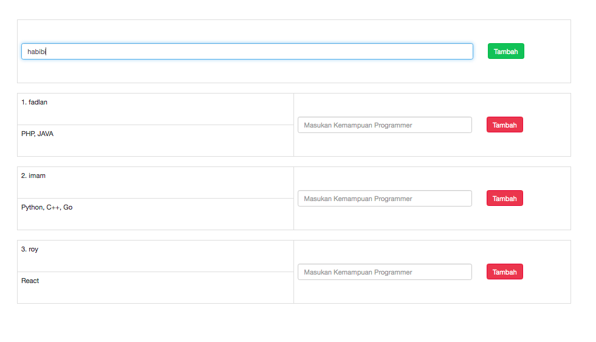
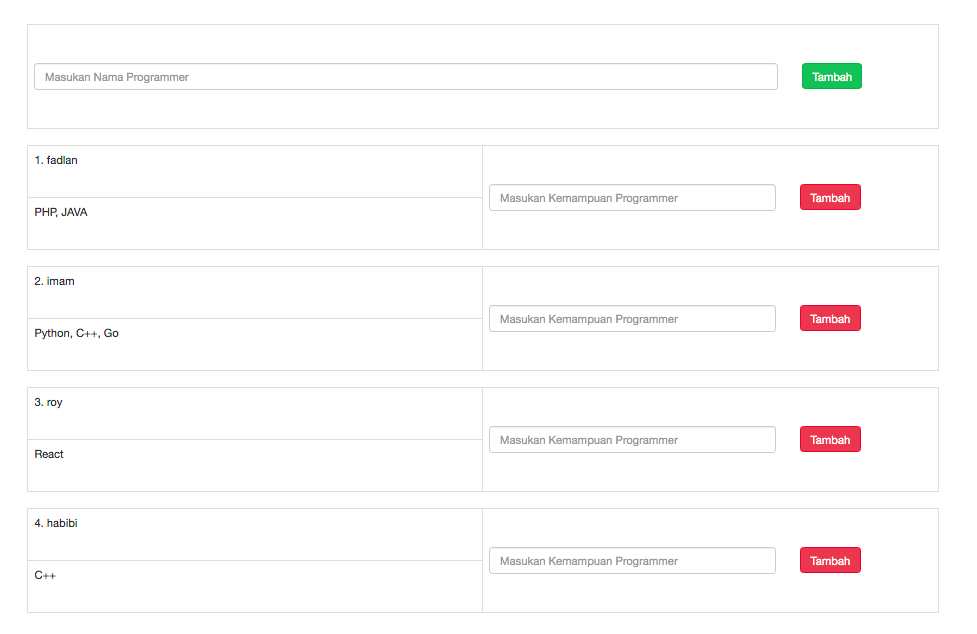
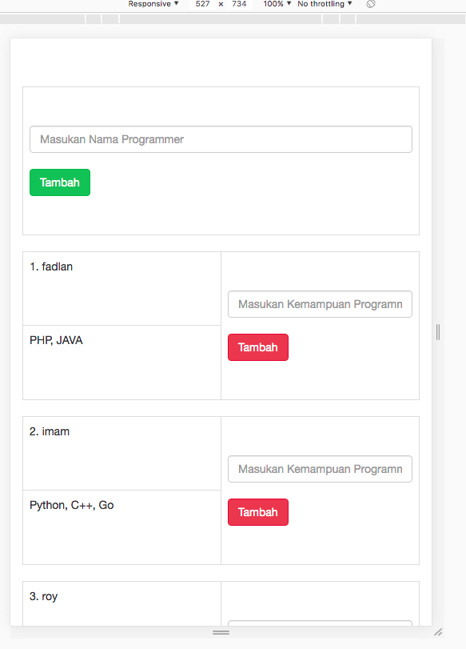

Nama: M Fadlan Aprial D

<ul>
Software Yang dibutuhkan :
<li>MAC OS EL-Capitan</li>
<li>Browser(Google Chrome)</li>
<li>AMPPS (untuk menjalankan Localhost)</li>
<li>Sublime Text (Engine Editor) sebuah teks editor yang sangat canggih untuk coding, markup dan lain-lain.
 </li></u>

<ul>
Panduan Menjalankan Sistem Program :
<li>Jalankan AMPPS dan nyalakan MYSQL & Apache</li>
<li>Taruh file semuanya pada folder WWW di AMPPS di MAC USER</li>
<li>Import DB dengan nama database pada Localhost/phpmyadmin</li>
<li>Panggil alamat folder di browser</li>
<li>Done</li></u>
<hl>
 
<ul>
Bahasa Pemrograman yang dipakai :
<li>HTML</li>
<li>JSON</li>
<li>PHP</li>
<li>CSS</li>
<li>Framework :  twitter bootstrap</li></ul>

Rest (Respresentational State Transfer) API (Application Programming Interface) adalah Rest adalah aturan dan gaya perancangan dan API penghubungnya sehingga sebuah webservice bisa melakukan request & response data yang dikirim/diterima berupa JSON.
<ul>
Kegunaan JSON (JavaScript Object Notation)
<li>berisi pasangan data key dan value</li>
<li>format pertukaran data tekstual dan sangat ringan</li>
<li>Sintaksnya sangat sederhana dan jelas(dibanding XML)</li>
<li>Dapat dikenalin dan dikomsumsi banyak bahasa pemrograman.</li>
<li>Digunakan untuk file konfigurasi (tetapi tidak support sintaks komentar).</li></ul>

 
<ul>
Capture:

<li>before</li>

<li>after</li>

<li>mobile</li>
</ul>
